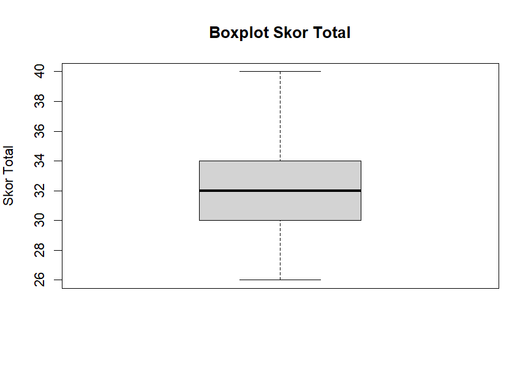
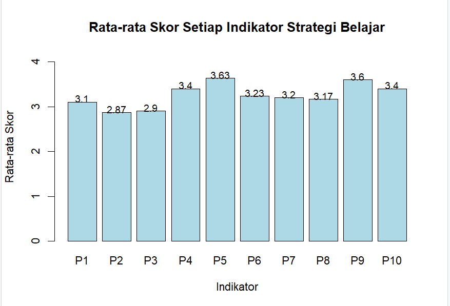

# Estimasi Rata-Rata Strategi Belajar Mahasiswa Program Studi Statistika Universitas Mataram Menggunakan Teknik Two-Stage Cluster Sampling

### 📂 Struktur Repository

```text
📦 Estimasi-RataRata-Strategi-Belajar
│
├── 📄 README.md
│   └── Dokumentasi lengkap penelitian
│
├── 📊 Data.xlsx
│   └── Data kuesioner strategi belajar mahasiswa
│
├── 💻 Sintaks Uas.R
│   └── Script analisis Two-Stage Cluster Sampling menggunakan R
│
├── 📈 Boxplot.png
│   └── Visualisasi boxplot skor total
│
└── 📊 Barplot.png
    └── Visualisasi rata-rata skor setiap indikator
```

### 📑 Daftar Isi

- [BAB I Pendahuluan](#bab-i-pendahuluan)
- [BAB II Metodelogi](#bab-ii-metodelogi)
- [BAB III Hasil dan Pembahasan](#bab-iii-hasil-dan-pembahasan)
- [BAB IV Penutup](#bab-iv-penutup)

## Bab I Pendahuluan
### 1.1 Latar Belakang
Strategi belajar merupakan salah satu faktor yang berperan penting dalam mendukung keberhasilan proses pembelajaran di perguruan tinggi. Melalui strategi belajar yang baik, mahasiswa dapat mengelola waktu belajar, memahami materi secara lebih efektif, serta meningkatkan kemampuan dalam menyelesaikan tugas akademik. Namun, setiap mahasiswa memiliki kebiasaan dan strategi belajar yang berbeda-beda, sehingga tingkat strategi belajar antar mahasiswa dapat bervariasi. Oleh karena itu, diperlukan informasi mengenai rata-rata strategi belajar mahasiswa sebagai gambaran umum kondisi strategi belajar pada tingkat populasi.
Salah satu teknik pengambilan sampel yang dapat digunakan adalah Two-Stage Cluster Sampling, yaitu teknik pengambilan sampel dua tahap dengan memilih kelas sebagai cluster pada tahap pertama, kemudian memilih mahasiswa secara acak dari kelas yang terpilih pada tahap kedua. Melalui teknik ini diharapkan dapat diperoleh sampel yang representatif sehingga estimasi rata-rata strategi belajar mahasiswa dapat menggambarkan kondisi populasi dengan tingkat ketelitian yang memadai.
### 1.2 Justifikasi Urgensi
Pengumpulan data dari seluruh mahasiswa Program Studi Statistika Universitas Mataram memerlukan waktu, biaya, dan tenaga yang relatif besar. Oleh karena itu, diperlukan metode pengambilan sampel yang efisien namun tetap mampu menghasilkan estimasi yang mewakili populasi. Teknik Two-Stage Cluster Sampling dipilih karena memungkinkan pengambilan sampel secara bertahap melalui pemilihan kelas sebagai cluster, kemudian pemilihan mahasiswa secara acak dari kelas yang terpilih, sehingga proses survei menjadi lebih efektif.
### 1.3 Tujuan
1.	Mengestimasi rata-rata strategi belajar mahasiswa Program Studi Statistika Universitas Mataram menggunakan teknik Two-Stage Cluster Sampling. 
2.	Menghitung bobot sampel berdasarkan peluang pemilihan pada setiap tahap pengambilan sampel. 
3.	Mengevaluasi ketelitian hasil estimasi melalui varians, standard error, confidence interval, relative standard error (RSE), dan design effect (Deff).

## Bab II Metodelogi
### 2.1 Populasi Target
Populasi target dalam penelitian ini adalah seluruh mahasiswa Program Studi Statistika Universitas Mataram yang terdaftar pada tahun akademik 2023 hingga 2025. Populasi ini mencakup mahasiswa dari berbagai angkatan dan kelas yang memiliki karakteristik pembelajaran yang beragam, sehingga dapat menggambarkan kondisi strategi belajar secara umum pada tingkat program studi.
Dalam konteks penelitian ini, populasi juga dapat dikelompokkan ke dalam beberapa kelas (cluster), sehingga memungkinkan penerapan teknik Two-Stage Cluster Sampling dalam proses pengambilan sampel penelitian.
### 2.2 Sampel dan Teknik Sampling
Sampel dalam penelitian ini adalah sebagian mahasiswa Program Studi Statistika Universitas Mataram yang dipilih dari populasi target menggunakan teknik Two-Stage Cluster Sampling. Teknik ini dilakukan secara bertahap untuk memperoleh sampel yang representatif dengan cara yang lebih efisien dibandingkan sensus.
#### Tahap 1 (First Stage Sampling)

Pemilihan **cluster** dilakukan menggunakan **Simple Random Sampling (SRS)**.

- Jumlah seluruh cluster : **6 kelas**
- Jumlah cluster terpilih : **2 kelas**
- Cluster terpilih : **2024 A** dan **2025 B**
- Metode pemilihan : **Simple Random Sampling (SRS)**

#### Tahap 2 (Second Stage Sampling)

Pemilihan mahasiswa pada setiap cluster terpilih dilakukan menggunakan **Simple Random Sampling (SRS)**.

| Cluster | Jumlah Mahasiswa | Sampel Terpilih | Metode |
|:--------|-----------------:|----------------:|:-------|
| 2024 A | 25 | 13 | SRS |
| 2025 B | 31 | 17 | SRS |

**Total sampel penelitian:** **30 mahasiswa**
### 2.3 Instrumen Penelitian
Instrumen penelitian yang digunakan berupa kuesioner untuk mengukur strategi belajar mahasiswa. Kuesioner terdiri dari 10 item pernyataan yang dinyatakan dalam bentuk skala Likert.

## 📋 Instrumen Penelitian Strategi Belajar Mahasiswa

| No | Kode | Pernyataan |
|----|------|------------|
| 1 | P1 | Saya membuat jadwal belajar agar waktu belajar saya lebih teratur. |
| 2 | P2 | Saya mempersiapkan materi sebelum mengikuti perkuliahan. |
| 3 | P3 | Saya membuat peta konsep agar lebih mudah memahami materi. |
| 4 | P4 | Saya mengerjakan latihan soal untuk memperdalam pemahaman materi. |
| 5 | P5 | Saya memanfaatkan tugas kuliah untuk memperdalam pemahaman saya terhadap materi. |
| 6 | P6 | Saya mengubah cara belajar jika hasil belajar saya belum memuaskan. |
| 7 | P7 | Saya mengevaluasi hasil belajar setelah mengikuti ujian atau kuis. |
| 8 | P8 | Saya mengurangi penggunaan media sosial saat belajar agar dapat lebih fokus. |
| 9 | P9 | Saya berdiskusi dengan teman untuk memahami materi kuliah. |
| 10 | P10 | Saya mencari referensi tambahan selain materi yang diberikan dosen untuk memahami materi kuliah. |

## 📏 Skala Likert

| Skor | Kategori |
|------|----------|
| 1 | Sangat Tidak Setuju |
| 2 | Tidak Setuju |
| 3 | Setuju |
| 4 | Sangat Setuju |

### 2.4 Teknik Analisis Data
1.	Pengumpulan Data
2.	Data Cleaning
3.	Penyusunan Skor Variabel
4.	Uji Validitas Instrumen
5.	Uji Reliabilitas Instrumen
6.	Perhitungan Peluang Pemilihan Sampel
7.	Pembobotan (Weighting)
8.	Estimasi rata - rata
9.	Estimasi dan inferensi
10.	Menghitung RSE dan Design Effect

## Tahapan analisis data berbasis R
#### 1. Library yang Digunakan
Library digunakan untuk mendukung proses analisis data dari tahap awal hingga akhir. Setiap library memiliki fungsi spesifik yang membantu proses analisis menjadi lebih efisien.
```r
library(readxl)
library(psych)
library(survey)
```
`readxl` digunakan untuk membaca file Excel, `psych` digunakan untuk uji validitas dan reliabilitas, `survey` digunakan untuk analisis data dengan desain sampling.
#### 2. Membaca dan Melihat Data
Tahap ini digunakan untuk mengimpor data penelitian dari file Excel ke dalam R. Setelah data dibaca, dilakukan pemeriksaan struktur data untuk memastikan data siap dianalisis.
```r
data <- read_excel("DATA ESTIMASI RATA RATA STRATEGI BELAJAR.xlsx")
View(data)
str(data)
head(data)
```
`str`dan`head`digunakan untuk melihat struktur dan sebagian data awal, `View` digunakan untuk menampilkan data dalam bentuk tabel.
#### 3. Mengambil Item Kuesioner
Tahap ini digunakan untuk memilih variabel P1 sampai P10 yang merupakan indikator strategi belajar mahasiswa. Hanya variabel P1–P10 yang digunakan dalam analisis.
```r
kuesioner <- data[, c("P1","P2","P3","P4","P5",
                      "P6","P7","P8","P9","P10")]
```
#### 4. Menghitung Skor Total
Skor total digunakan untuk merepresentasikan tingkat strategi belajar setiap responden. Nilai ini diperoleh dengan menjumlahkan seluruh item kuesioner.
```r
data$Total <- rowSums(kuesioner)
```
`rowSums` digunakan untuk menjumlahkan seluruh item P1-P10 per responden.
#### 5. Data Cleaning
Tahap ini dilakukan untuk memastikan kualitas data sebelum analisis. Pengecekan dilakukan terhadap data hilang, distribusi data, serta outlier.
```r
colSums(is.na(data))
boxplot(data$Total)
```
`is.na` digunakan untuk mengecek data hilang, `boxplot` digunakan untuk mendeteksi outlier pada skor total.
#### 6. Uji Validitas
Uji validitas digunakan untuk melihat apakah setiap item kuesioner mampu mengukur variabel strategi belajar dengan baik.
```r
hasil_validitas <- data.frame(
  Item = names(kuesioner),
  r_hitung = sapply(kuesioner, function(x) cor(x, data$Total)),
  p_value = sapply(kuesioner, function(x) cor.test(x, data$Total)$p.value))
```
Nilai `r_hitung` menunjukkan kekuatan hubungan, `p_value` digunakan untuk melihat signifikansi hasil uji.
#### 7. Uji Reliabilitas
Uji reliabilitas digunakan untuk mengukur konsistensi internal dari instrumen penelitian. Cronbach’s Alpha digunakan sebagai indikator utama.
```r
hasil_alpha <- alpha(kuesioner)
hasil_alpha$total
```
`alpha` digunakan untuk menghitung Cronbach's Alpha.
#### 8. Pembobotan Two-Stage Cluster Sampling
Pembobotan dilakukan berdasarkan peluang pemilihan pada dua tahap sampling. Bobot digunakan agar hasil estimasi dapat mewakili populasi secara lebih akurat.
```r
N_cluster <- 6
n_cluster <- 2
p1 <- n_cluster / N_cluster

N_2024A <- 25
n_2024A <- 13
p2_2024A <- n_2024A / N_2024A

N_2025B <- 31
n_2025B <- 17
p2_2025B <- n_2025B / N_2025B

p_total_2024A <- p1 * p2_2024A
p_total_2025B <- p1 * p2_2025B

w_2024A <- 1 / p_total_2024A
w_2025B <- 1 / p_total_2025B
```
#### 9. Estimasi Rata-rata Berbobot
Estimasi ini digunakan untuk menghitung rata-rata strategi belajar mahasiswa berdasarkan bobot sampel.
```r
Estimasi_Rata2 <- sum(data$Bobot * data$Total) /
  sum(data$Bobot)
```
#### 10. Desain Survei
Desain survei digunakan untuk mendefinisikan struktur sampling dalam analisis lanjutan.
```r
data$Cluster <- paste(data$Angkatan, data$Kelas, sep = "_")

desain <- svydesign(
  id = ~Cluster,
  weights = ~Bobot,
  data = data)
```
`svydesign` digunakan untuk mendefinisikan desain survei.
#### 11. Estimasi & Inferensi
Tahap ini digunakan untuk menghitung estimasi rata-rata, varians, standard error, dan interval kepercayaan.
```r
estimasi_mean <- svymean(~Total, desain)
confint(estimasi_mean)
SE(estimasi_mean)
```
`svymean` digunakan untuk menghitung rata-rata berbobot, `confint` menghasilkan interval kepercayaan, `SE` digunakan untuk menghitung standard error.
#### 12. RSE & Design Effect
Tahap ini digunakan untuk mengevaluasi kualitas estimasi.
```r
RSE <- (SE(estimasi_mean) / coef(estimasi_mean)) * 100
deff(estimasi_mean)
```
`RSE` menunjukkan tingkat ketelitian relatif estimasi, `deff` menunjukkan efisiensi desain dibanding SRS.
#### 13. Visualisasi Rata-rata Setiap Indikator
Visualisasi digunakan untuk menggambarkan rata-rata skor pada setiap indikator strategi belajar mahasiswa.
```r
# Menghitung rata-rata tiap indikator
rata_indikator <- colMeans(kuesioner)
# Diagram batang
bp <- barplot(
  rata_indikator,
  main = "Rata-rata Skor Setiap Indikator Strategi Belajar",
  xlab = "Indikator",
  ylab = "Rata-rata Skor",
  ylim = c(0, 4.2),
  names.arg = names(rata_indikator),
  col = "lightblue",
  border = "black"
)
# Menambahkan nilai rata-rata di atas batang
text(
  x = bp,
  y = rata_indikator + 0.08,
  labels = round(rata_indikator, 2),
  cex = 0.9
)
```
`colMenas` digunakan untuk menghitung rata-rata skor pada setiap item, `barplot` digunakan untuk menampilkan rata-rata dalam bentuk diagram batang,`text` digunakan untuk memberikan keterangan nilai rata-rata.
## Bab III Hasil dan Pembahasan
### 3.1 Gambaran Umum Data
Data penelitian terdiri atas 30 responden yang berasal dari dua kelas terpilih, yaitu kelas 2024 A dan 2025 B. Dataset memuat variabel Angkatan, Kelas, sepuluh item kuesioner (P1–P10), serta skor total (Total) yang diperoleh dari penjumlahan seluruh item kuesioner. Berdasarkan enam baris pertama data (head data), setiap responden memiliki skor pada rentang 1–4 untuk setiap item sesuai dengan skala Likert yang digunakan.

| Angkatan | Kelas | P1 | P2 | P3 | P4 | P5 | P6 | P7 | P8 | P9 | P10 | Total |
|:--------:|:-----:|---:|---:|---:|---:|---:|---:|---:|---:|---:|----:|------:|
| 2024 | A | 2 | 3 | 3 | 3 | 4 | 3 | 2 | 2 | 3 | 4 | 29 |
| 2024 | A | 3 | 3 | 3 | 3 | 3 | 3 | 3 | 3 | 3 | 3 | 30 |
| 2024 | A | 3 | 3 | 3 | 4 | 4 | 2 | 3 | 3 | 3 | 4 | 32 |
| 2024 | A | 4 | 4 | 4 | 4 | 4 | 4 | 4 | 4 | 4 | 4 | 40 |
| 2024 | A | 3 | 2 | 3 | 3 | 3 | 3 | 3 | 3 | 3 | 3 | 29 |
| 2024 | A | 4 | 3 | 4 | 3 | 4 | 3 | 4 | 4 | 3 | 4 | 36 |

Enam baris pertama (*head data*) menunjukkan struktur dataset yang digunakan dalam penelitian. Setiap responden memiliki informasi mengenai **angkatan**, **kelas**, skor pada **10 indikator strategi belajar (P1–P10)**, serta **skor total** yang merupakan penjumlahan seluruh indikator.
### 3.2 Hasil Data Cleaning
#### 1. Missing Value
Pengecekan missing value dilakukan untuk memastikan bahwa seluruh data yang digunakan dalam analisis telah terisi dengan lengkap.

| Variabel | Jumlah Missing Value |
|----------|---------------------:|
| Angkatan | 0 |
| Kelas | 0 |
| P1-P10 | 0 |

Hasil pengecekan menunjukkan bahwa seluruh variabel memiliki nilai **0** pada jumlah *missing value*. Hal ini menunjukkan bahwa tidak terdapat data yang hilang pada dataset sehingga seluruh responden dapat digunakan dalam proses analisis. 
#### 2. Outliers

<p align="center">
  
</p>

<p align="center">
<b>Gambar 1.</b> Boxplot skor total strategi belajar mahasiswa.
</p>

Boxplot digunakan untuk mendeteksi keberadaan **outlier** pada skor total strategi belajar mahasiswa. Berdasarkan visualisasi, tidak terdapat titik yang berada di luar whisker sehingga **tidak ditemukan outlier** pada data. 
### 3.3 Hasil Uji Validitas
Uji validitas dilakukan untuk mengetahui kemampuan setiap item kuesioner dalam mengukur variabel strategi belajar mahasiswa. 

| Item | r<sub>hitung</sub> | p-value | Keputusan |
|:----:|-------------------:|---------:|:---------:|
| P1 | 0.724 | < 0.001 | Valid |
| P2 | 0.670 | < 0.001 | Valid |
| P3 | 0.628 | < 0.001 | Valid |
| P4 | 0.586 | < 0.001 | Valid |
| P5 | 0.475 | 0.008 | Valid |
| P6 | 0.664 | < 0.001 | Valid |
| P7 | 0.687 | < 0.001 | Valid |
| P8 | 0.568 | 0.001 | Valid |
| P9 | 0.458 | 0.011 | Valid |
| P10 | 0.596 | < 0.001 | Valid |

Berdasarkan hasil uji validitas, seluruh item kuesioner memiliki nilai **r<sub>hitung</sub>** positif dan nilai **p-value < 0,05**, sehingga seluruh item dinyatakan **valid**. Oleh karena itu, seluruh item **P1–P10** layak digunakan pada tahap analisis selanjutnya.
### 3.4 Hasil Uji Realibitas
Uji reliabilitas dilakukan untuk mengetahui tingkat konsistensi instrumen penelitian dalam mengukur variabel strategi belajar mahasiswa. Pengujian dilakukan menggunakan metode **Cronbach's Alpha**.

| Metode | Nilai Cronbach's Alpha | Kriteria | Keputusan |
|:-------|-----------------------:|:---------|:---------:|
| Cronbach's Alpha | 0.811 | ≥ 0,70 | Reliabel |

Hasil uji reliabilitas menunjukkan bahwa nilai **Cronbach's Alpha** sebesar **0,811**. Nilai tersebut lebih besar dari **0,70**, sehingga instrumen penelitian dinyatakan **reliabel**. 
### 3.5 Hasil Pembobotan

#### Perhitungan Bobot
#### 1. Peluang Pemilihan Cluster (Tahap 1)
Jumlah seluruh kelas = 6
Jumlah kelas terpilih = 2

$$
P_1=\frac{n_c}{N_c}
=\frac{2}{6}
=0,3333
$$

---
#### 2. Peluang Pemilihan Mahasiswa (Tahap 2)
**Kelas 2024 A**
Jumlah mahasiswa = 25
Jumlah sampel = 13

$$
P_2=\frac{13}{25}=0,52
$$

**Kelas 2025 B**
Jumlah mahasiswa = 31
Jumlah sampel = 17

$$
P_2=\frac{17}{31}=0,5484
$$

---
#### 3. Peluang Pemilihan Gabungan
**Kelas 2024 A**

$$
P=P_1\times P_2
$$

$$
=0,3333\times0,52
$$

$$
=0,1733
$$

**Kelas 2025 B**

$$
P=P_1\times P_2
$$

$$
=0,3333\times0,5484
$$

$$
=0,1828
$$

---
#### 4. Menghitung Bobot
**Kelas 2024 A**

$$
w=\frac{1}{0,1733}
=5,769
$$

**Kelas 2025 B**

$$
w=\frac{1}{0,1828}
=5,471
$$

| Kelas | Jumlah Mahasiswa (N) | Sampel (n) | Bobot |
|:------|---------------------:|-----------:|-------:|
| 2024 A | 25 | 13 | 5.769 |
| 2025 B | 31 | 17 | 5.471 |

Hasil pembobotan menunjukkan bahwa responden dari **kelas 2024 A** memiliki bobot sebesar **5,769**, sedangkan responden dari **kelas 2025 B** memiliki bobot sebesar **5,471**. Perbedaan bobot ini terjadi karena peluang pemilihan mahasiswa pada masing-masing kelas tidak sama, yang dipengaruhi oleh perbedaan jumlah anggota populasi dan jumlah sampel yang dipilih pada setiap kelas.
### 3.6 Hasil Estimasi Titik dan Estimasi Rata-rata
Pada tahap ini dihitung estimasi titik (weighted point estimate) dan estimasi rata-rata strategi belajar mahasiswa berdasarkan data sampel.

| Parameter | Nilai |
|:----------|------:|
| Estimasi Titik | 5459.851 |
| Estimasi Rata-rata | 32.499 |

Hasil estimasi menunjukkan bahwa **estimasi titik** sebesar **5459,851**, yaitu jumlah skor total yang telah mempertimbangkan bobot setiap responden. Sementara itu, **estimasi rata-rata** strategi belajar mahasiswa sebesar **32,499**, yang merupakan pendugaan rata-rata skor strategi belajar pada populasi mahasiswa Program Studi Statistika Universitas Mataram. 
### 3.7 Hasil Analisis Survei
Analisis ini bertujuan untuk memperoleh estimasi rata-rata populasi beserta ukuran ketelitiannya, seperti varians, *standard error*, interval kepercayaan, dan *Relative Standard Error (RSE)*.

| Parameter | Nilai |
|:----------|------:|
| Estimasi Rata-rata | 32.499 |
| Varians | 0.001125 |
| Standard Error (SE) | 0.033547 |
| Confidence Interval (95%) | (32.433 ; 32.565) |
| Relative Standard Error (RSE) | 0.103% |

Berdasarkan hasil analisis survei, diperoleh estimasi rata-rata strategi belajar mahasiswa sebesar **32,499** dengan **standard error sebesar 0,0335**. Nilai **varians sebesar 0,001125** menunjukkan bahwa penyebaran hasil estimasi relatif kecil sehingga estimasi yang diperoleh cukup stabil. Selain itu, interval kepercayaan 95% berada pada rentang **32,433–32,565**, yang menunjukkan bahwa rata-rata populasi diperkirakan berada dalam rentang tersebut dengan tingkat kepercayaan 95%. Nilai **RSE sebesar 0,103%** yang jauh di bawah batas 25% mengindikasikan bahwa estimasi memiliki tingkat ketelitian yang sangat baik, sehingga hasil estimasi dapat dipercaya untuk menggambarkan kondisi populasi.
### 3.8 Design Effect (Deff)

| Parameter | Nilai |
|:----------|------:|
| Design Effect (Deff) | 0.002873 |

Nilai **Design Effect (Deff)** yang diperoleh sebesar **0,002873**. Nilai ini lebih kecil dari **1**, yang menunjukkan bahwa berdasarkan hasil analisis, desain **Two-Stage Cluster Sampling** menghasilkan varians yang lebih kecil dibandingkan apabila menggunakan **Simple Random Sampling (SRS)** dengan ukuran sampel yang sama. Dengan demikian, desain sampling yang digunakan pada penelitian ini dapat dikatakan lebih efisien dalam menghasilkan estimasi rata-rata strategi belajar mahasiswa.
### 3.9 Visualisasi

<p align="center">
  
</p>

<p align="center">
<b>Gambar 2.</b> Barplot rata rata skor total strategi belajar mahasiswa.
</p>

Diagram batang menunjukkan rata-rata skor pada setiap indikator strategi belajar mahasiswa. Indikator **P5** memiliki rata-rata skor tertinggi, sedangkan **P2** memiliki rata-rata skor terendah. Secara keseluruhan, rata-rata setiap indikator relatif tidak jauh berbeda, sehingga strategi belajar mahasiswa dapat dikatakan cukup baik dan merata.
## Bab IV Penutup
### 4.1 Kesimpulan
Berdasarkan hasil penelitian, dapat disimpulkan bahwa:
1. Estimasi rata-rata strategi belajar mahasiswa Program Studi Statistika Universitas Mataram menggunakan metode **Two-Stage Cluster Sampling** diperoleh sebesar **32,499**, yang menunjukkan bahwa secara umum mahasiswa memiliki strategi belajar yang baik.
2. Pembobotan sampel berhasil dilakukan berdasarkan peluang pemilihan pada setiap tahap pengambilan sampel, dengan bobot sebesar **5,769** untuk kelas **2024 A** dan **5,471** untuk kelas **2025 B**.
3. Hasil evaluasi ketelitian menunjukkan bahwa estimasi yang diperoleh memiliki kualitas yang baik, ditunjukkan oleh nilai **varians sebesar 0,001125**, **standard error sebesar 0,033547**, **confidence interval 95% sebesar (32,433–32,565)**, **RSE sebesar 0,103%**, serta **Deff sebesar 0,002873** yang menunjukkan desain sampling yang digunakan cukup efisien.
### 4.2 Rekomendasi
Berdasarkan hasil penelitian, beberapa rekomendasi yang dapat diberikan adalah:
1. Penelitian selanjutnya disarankan menggunakan jumlah cluster dan ukuran sampel yang lebih besar agar estimasi yang diperoleh semakin representatif.
2. Penelitian selanjutnya dapat menerapkan atau membandingkan metode **Two-Stage Cluster Sampling** dengan teknik sampling lainnya untuk mengevaluasi ketepatan dan efisiensi hasil estimasi.
3. Penelitian selanjutnya juga dapat menambahkan variabel atau indikator lain yang berkaitan dengan strategi belajar sehingga informasi yang diperoleh menjadi lebih komprehensif.

## Link Kuisoner
https://forms.gle/vQ2U9fjSRTy5ek756
